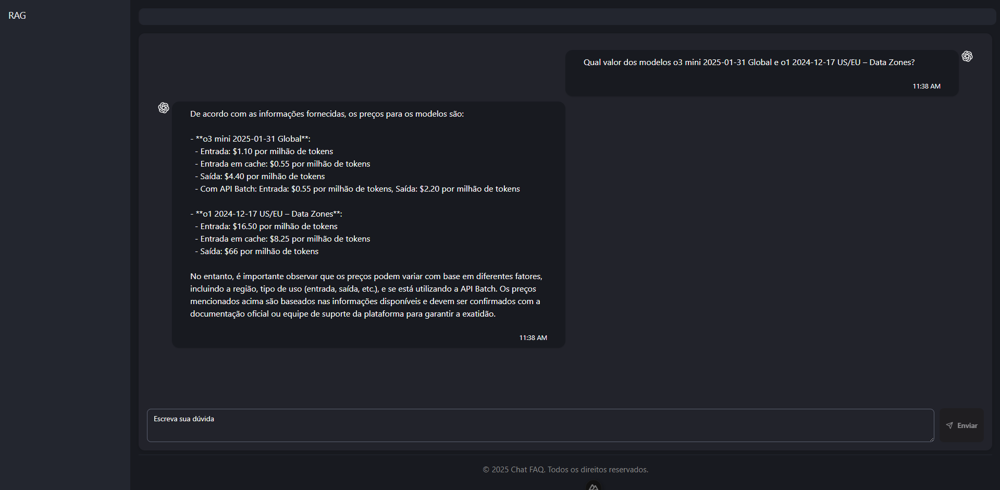

# 📘 RAG System: Preprocessing and LLM Chat Interface

This repository contains two main components:

1. **Knowledge base preprocessing** (`rag` folder)
2. **Frontend chat interface for LLM interaction via RAG** (`chat` folder)

---

## 📂 1. `rag` Folder — Knowledge Base Preprocessing

Python scripts used to prepare and vectorize the knowledge base.

### 🔧 Tools used:
- [LangChain](https://github.com/langchain-ai/langchain)
- [Pandas](https://pandas.pydata.org/)
- [ChromaDB](https://www.trychroma.com/)

### ▶️ How to run:

```bash
cd rag
python preprocessing.py
```

This will generate a `chroma_db` folder containing the vectorized database.

### ✅ Testing via Python:

You can test it directly with:

```bash
python run_model.py
```

---

## 💬 2. `chat` Folder — Web Interface with Nuxt.js 3

Frontend application to interact with the LLM in a conversational way.

### ⚙️ Tools used:
- [Nuxt.js 3](https://nuxt.com/)
- [shadcn-vue](https://github.com/shadcn-ui/vue)
- [LangChain.js](https://js.langchain.com/)
- [ChatGroq](https://www.groq.com/)

---

## 💡 Running the Complete System

### Step 1 — Knowledge Base Preprocessing

```bash
cd rag
python preprocessing.py
```

---

### Step 2 — Run ChromaDB as a Service (optional)

> ⚠️ If you're using the Nuxt.js frontend, you must run `chroma` manually.  
> **This step is not required if you use only the Python script (`run_model.py`)**, as it starts Chroma automatically.

#### 📦 Install Chroma:

[Installation Reference](https://docs.trychroma.com/cli/install)

```bash
curl -sSL https://raw.githubusercontent.com/chroma-core/chroma/main/rust/cli/install/install.sh | bash
```

#### 🚀 Run Chroma with the Knowledge Base:

```bash
chroma run --path ./chroma_db
```

---

### Step 3 — Run the Frontend Chat

```bash
cd chat
npm i
npm run dev
```

The application will be available at `http://localhost:3000`

## 📷 System Interface

Below is the main chat screen:



---

## 🧠 Final Project Structure

```
📁 rag/
  ├── preprocessing.py
  ├── run_model.py
  └── chroma_db/
📁 chat/
  └── (Nuxt.js application)
```

---

## 📄 License

This project is open source and licensed under the [MIT License](LICENSE).