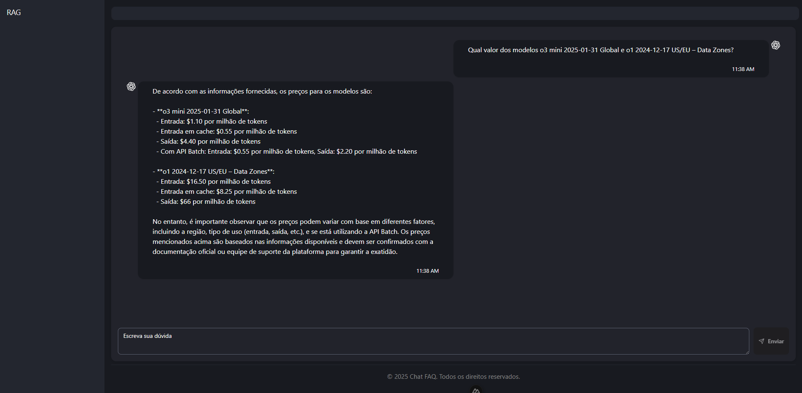

# 💡 Sistema RAG: Comparador de Modelos GenAI (Google vs Microsoft)

Este projeto é um sistema RAG (Retrieval-Augmented Generation) que compara os valores dos modelos GenAI oferecidos pelas plataformas da **Google (Vertex AI)** e **Microsoft (Azure OpenAI)**.

As informações são extraídas diretamente das páginas oficiais:
- [Preços Microsoft Azure OpenAI](https://azure.microsoft.com/en-us/pricing/details/cognitive-services/openai-service/)
- [Preços Google Vertex AI](https://cloud.google.com/vertex-ai/generative-ai/pricing?hl=pt-br)

---

## 🚀 Tecnologias Utilizadas

### 🔧 Frontend
- [Nuxt.js 3](https://nuxt.com/)
- [Shadcn-vue](https://github.com/shadcn-ui/vue) (UI moderna e acessível)
- Renderização: **SSR (Server Side Rendering)**

### 🧠 Backend / IA
- [Langchain.js](https://js.langchain.com/) (orquestração RAG)
- [ChromaDB](https://www.trychroma.com/) (vetorstore de conhecimento)
- [ChatGroq](https://www.groq.com/) (modelo LLM via API)

---

## 📷 Interface do Sistema

Abaixo, a tela principal do chat:



---

## ⚙️ Como rodar localmente

### 1. Instale as dependências:
```bash
npm i
```

### 2. Inicie o ambiente de desenvolvimento:
```bash
npm run dev
```

O servidor estará disponível em: `http://localhost:3000`

---

## 📚 Estrutura da Base de Conhecimento

A base de conhecimento é montada a partir do conteúdo extraído dos sites da Microsoft e Google, convertida em chunks vetorizados com o **ChromaDB** e buscada dinamicamente durante o uso da aplicação via Langchain.

---

## 📩 Contribuições

Sinta-se à vontade para abrir _issues_ ou enviar PRs com sugestões e melhorias!

---

## 📄 Licença

Este projeto é open source e licenciado sob a [MIT License](LICENSE).